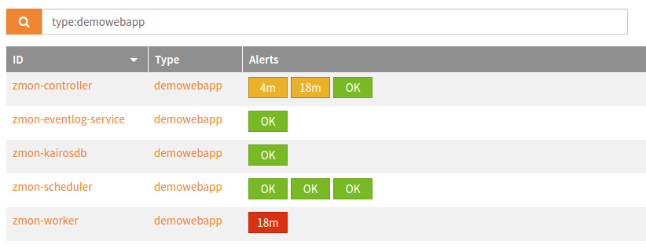

************
Introduction
************

ZMON is a flexible and extensible open-source platform monitoring tool developed at Zalando_ and is in production use since early 2014.
It offers proven scaling with its distributed nature and fast storage with KairosDB on top of Cassandra.
ZMON splits checking(data acquisition) from the alerting responsibilities and uses abstract entities to describe what's being monitored.
Its checks and alerts rely on Python expressions, giving the user a lot of power and connectivity.
Besides the UI it provides RESTful APIs to manage and configure most properties automatically.

Anyone can use ZMON, but offers particular advantages for technical organizations with many autonomous teams.
Its front end (see Demo_ / Bootstrap_ / Kubernetes_/ Vagrant_) comes with Grafana3 "built-in," enabling teams to create and manage their own data-driven dashboards along side ZMON's own team/personal dashboards for alerts and custom widgets.
Being able to inherit and clone alerts makes it easier for teams to reuse and share code.
Alerts can trigger HipChat, Slack, and E-Mail notifications.
iOS and Android clients are works in progress, but push notifications are already implemented.

ZMON also enables painless integration with CMDBs and deployment tools.
It also supports service discovery via custom adapters or its built-in entity service's REST API.
For an example, see zmon-aws-agent_ to learn how we connect AWS service discovery with our monitoring in the cloud.

Feel free to contact us via `slack.zmon.io`_.

ZMON Components
===============

.. image:: images/components.svg

A minimum ZMON setup requires these four components:

- zmon-controller_: UI/Grafana/Oauth2 Login/Github Login
- zmon-scheduler_: Scheduling check/alert evaluation
- zmon-worker_: Doing the heavy lifting
- zmon-eventlog-service_: History for state changes and modifications

Plus the storage covered in the :ref:`requirements` section.

The following components are optional:

- zmon-cli_: A command line client for managing entities/checks/alerts if needed
- zmon-aws-agent_: Works with the AWS API to retrieve "known" applications
- zmon-data-service_: API for multi DC federation: receiver for remote workers primarily
- zmon-metric-cache_: Small scale special purpose metric store for API metrics in ZMON's cloud UI
- zmon-notification-service_: Provides mobile API and push notification support for GCM to Android/iOS app
- zmon-android_: An Android client for ZMON monitoring
- zmon-ios_: An iOS client for ZMON monitoring

ZMON Origins
============

ZMON was born in late 2013 during Zalando's annual `Hack Week`_, when a group of Zalando engineers aimed to develop a replacement for ICINGA.
Scalability, manageability and flexibility were all critical, as Zalando's small teams needed to be able to monitor their services independent of each other.
In early 2014, Zalando teams began migrating all checks to ZMON, which continues to serve Zalando Tech.

Entities
========

ZMON uses entities to describe your infrastructure or platform, and to bind check variables to fixed values.

.. code-block:: json

  {
	"type":"host",
	"id":"cassandra01",
	"host":"cassandra01",
	"role":"cassandra-host",
	"ip":"192.168.1.17",
	"dc":"data-center-1"
  }

Or more abstract objects:

.. code-block:: json

  {
  	"type":"postgresql-cluster",
  	"id":"article-cluster",
  	"name":"article-cluster",
  	"shards": {
		"shard1":"articledb01:5432/shard1",
		"shard2":"articledb02:5432/shard2"
  	}
  }

Entity properties are not defined in any schema, so you can add properties as you see fit. This enables finer-grained filtering or selection of entities later on. As an example, host entities can include a physical model to later select the proper hardware checks.

Below you see an exmple of the entity view with alerts per entity.

Checks
======

A check describes how data is acquired. Its key properties are: a command to execute and an entity filter. The filter selects a subset of entities by requiring an overlap on specified properties. An example:

.. code-block:: json

  {
    "type":"postgresql-cluster", "name":"article-cluster"
  }

The check command itself is an executable Python_ expression. ZMON provides many custom wrappers that bind to the selected entity. The following example uses a PostgreSQL wrapper to execute a query on every shard defined above:

.. code-block:: python

  # sql() in this context is aware of the "shards" property

  sql().execute('SELECT count(1) FROM articles "total"').result()

A check command always returns a value to the alert. This can be of any Python type.

Not familiar with Python's functional expressions? No worries: ZMON allows you to define a top-level function and define your command in an easier, less functional way:

.. code-block:: python

  def check():
    # sql() binds to the entity used and thus knows the connection URLs
    return sql().execute('SELECT count(1) FROM articles "total"').result()

Alerts
======

A basic alert consists of an alert condition, an entity filter, and a team.
An alert has only two states: up or down.
An alert is up if it yields anything but False; this also includes exceptions thrown during evaluation of the check or alert, e.g. in the event of connection problems.
ZMON does not support levels of criticality, or something like "unknown", but you have a color option to customize sort and style on your dashboard (red, orange, yellow).

Let's revisit the above PostgreSQL check again. The alert below would either popup if there are no articles found or if we get an exception connecting to the PostgreSQL database.

.. code-block:: yaml

  team: database
  entities:
    - type: postgresql-cluster
  alert_condition: |
    value <= 0

Alerts raised by exceptions are marked in the dashboard with a "!".

Via ZMON's UI, alerts support parameters to the alert condition.
This makes it easy for teams/users to implement different thresholds, and — with the priority field defining the dashboard color — render their dashboards to reflect their priorities.

Dashboards
==========

Dashboards include a widget area where you can render important data with charts, gauges, or plain text.
Another section features rendering of all active alerts for the team filter, defined at the dashboard level.
Using the team filter, select the alerts you want your dashboard to include.
Specify multiple teams, if necessary. TAGs are supported to subselect topics.

.. image:: images/dashboard.png

REST API and CLI
================

To make your life easier, ZMON's REST API manages all the essential moving parts to support your daily work — creating and updating entities to allow for sync-up with your existing infrastructure.
When you create and modify checks and alerts, the scheduler will quickly pick up these changes so you won't have to restart or deploy anything.

And ZMON's command line client - a slim wrapper around the REST API - also adds usability by making it simpler to work with YAML files or push collections of entities.

Development Status
==================
The team behind ZMON continues to improve performance and functionality. Please let us know via GitHub's issues tracker if you find any bugs or issues.

.. _Python: http://www.python.org
.. _Zalando: https://tech.zalando.de/
.. _zmon-controller: https://github.com/zalando-zmon/zmon-controller
.. _Demo: https://demo.zmon.io
.. _Bootstrap: https://github.com/zalando-zmon/zmon-demo
.. _Vagrant: https://github.com/zalando/zmon
.. _zmon-scheduler: https://github.com/zalando-zmon/zmon-scheduler
.. _zmon-worker: https://github.com/zalando-zmon/zmon-worker
.. _zmon-eventlog-service: https://github.com/zalando-zmon/zmon-eventlog-service
.. _zmon-android: https://github.com/zalando-zmon/zmon-android
.. _zmon-ios: https://github.com/zalando-zmon/zmon-ios
.. _zmon-cli: https://github.com/zalando-zmon/zmon-cli
.. _zmon-actuator: https://github.com/zalando-zmon/zmon-actuator
.. _zmon-aws-agent: https://github.com/zalando-zmon/zmon-aws-agent
.. _zmon-data-service: https://github.com/zalando-zmon/zmon-data-service
.. _zmon-notification-service: https://github.com/zalando-zmon/zmon-notification-service
.. _zmon-metric-cache: https://github.com/zalando-zmon/zmon-metric-cache
.. _Hack Week: https://tech.zalando.de/blog/?tags=Hack%20Week
.. _slack.zmon.io: https://slack.zmon.io
.. _Kubernetes: https://github.com/zalando-zmon/zmon-kubernetes
