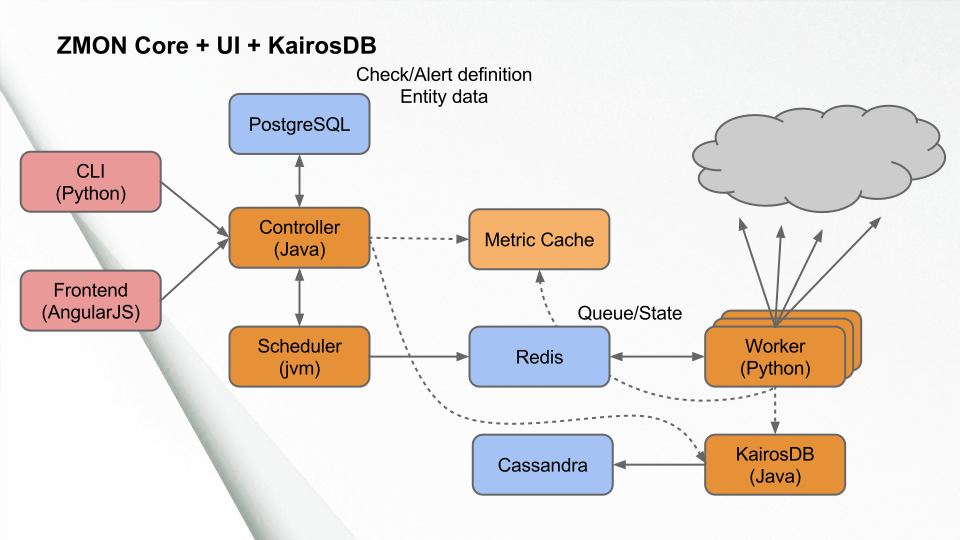
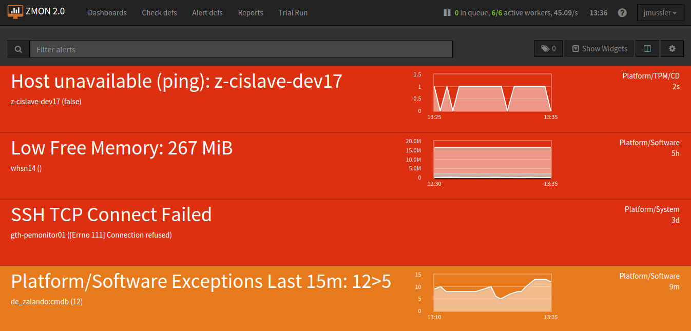

************
Introduction
************

ZMON is Zalando's open source platform monitoring tool. A team of Zalando Technology started the development in a Hackweek late 2013 to replace ICINGA. Scalability was crucial but manageability and flexibility were equally important. By then a lot of small teams needed to monitor their services independent of each other. Early 2014 it went into production and teams migrated all checks from ICINGA to ZMON which serves Zalando Tech until today.

The main concepts behind ZMON are a split of responsibilities between checks and alerts and the use of entities to describe everything to monitor. Both are being managed by RESTful APIs giving teams the power to configure their requirements autonomously. ZMON's Frontend also allows you to manage alerts and dashboards. At the same time ZMON's UI comes with Grafana "build in" to power data heavy dashboards. Observed data in general is shared between teams, alerts can be inherited and cloned to reuse code and knowledge. A built-in understanding of teams and privileges build around teams improves the usability in an environment with many teams.

Custom adapters or use of the buildin entity service's REST API allows easy integration into existing tools like CMDBs, service discovery or deploy tools. With the ZMON AWS Agent there exists an example how we connect AWS instance discovery with our monitoring.

Entities
========

Entities are used in ZMON to describe your infrastructure or platform. They are used to basically bind check variables to fixed values.

.. code-block:: json

  {
	"type":"host",
	"id":"cassandra01",
	"host":"cassandra01",
	"role":"cassandra-host",
	"ip":"192.168.1.17",
	"dc":"data-center-1"
  }

Or more abstract objects:

.. code-block:: json

  {
  	"type":"postgresql-cluster",
  	"id":"article-cluster",
  	"name":"article-cluster",
  	"shards": {
		"shard1":"articledb01:5432/shard1",
		"shard2":"articledb02:5432/shard2"
  	}
  }

Entity properties are not defined in any schema, you can add properties as you feel fit, enabling later a finer grained filtering or selection of entities. E.g. our host entities also include a physical model to later select the proper hardware checks.

Checks
======

A check describes how data is acquired, where the two key properties are: An entity filter and a check command. The entity filter selects a subset of entities by requiring an overlap on specified properties.

Example:

.. code-block:: json

  {
    "type":"host", "role":"cassandra-host"
  }

The check command itself is an executable Python_ expression. ZMON provides a lot of custom functions that are bound to the selected entity. The following example uses our PostgreSQL wrapper to execute a query on every shard defined above.

.. code-block:: python

  # sql() in this context is aware of the "shards" property

  sql().execute("SELECT 1 as a").results()

A check command always returns a value to the alert, this can be of any type.

For people less familiar with Pythons ZMON also allows you to define a function on the top level and define your command in an easier less functional way:

.. code-block:: python

  def check():
    # entity will be injected as entity
    return sql().execute("SELECT 1 as a").result()

Alerts
======

A basic alert consists of an alert condition, and entity filter, and a team. More properties are available like exclude entities, details are explained later. Any alert has only two states, up or down. We do not support levels of criticality, and something like unknown. And alert is up, if it yields anything but False. This also includes exceptions thrown from check or alert expression, e.g. in case of connection problems.

Going back to the PostgreSQL check the below alert would pop up if either shard is not reachable, making use of exceptions bubbling up from the check command itself.

.. code-block:: yaml

  team: database
  entities:
    - type: postgresql-cluster
  alert_condition: "False"

Alerts support parameters to the alert condition via UI, thus teams can decide to easily implement different thresholds. Together with the priority field defining the dashboard color this enables users to render their dashboards according to their understanding of priorities.

Dashboards
==========

Dashboards consists of a widget area where you can render important data in a graphical way, with charts, gauges or just text. The second section consists of rendering all active alerts for the team filter defined on dashboard level. Using the team filter you select the alerts you want to have on your dashboards, multiple teams can be specified. Additionally TAGs are supported to subselect topics.

REST API and CLI
================

ZMON features a REST API to manage all the essential moving parts during your daily work: creating and updating entities, which allows easy sync with your existing infrastructure. Creating and modifying checks and alerts is possible, the scheduler will pick changes up quickly, no need to restart or deploy anything.

To make your life easier there is the command line client, a slim wrapper around the REST API, that makes it easier for humans to work with it, hiding away some issues and enabling e.g. working with YAML files or pushing collections of entities.

.. _Python: http://www.python.org
